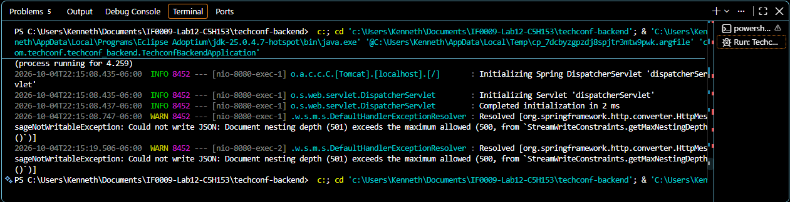

# IF0009 - Laboratorio 12: TechConf Full-Stack

## Parte 2: Análisis y depuración del error de recursión infinita

### Contexto
La relación entre `Charla` y `Asistente` es bidireccional:
- `Charla` tiene `@OneToMany(mappedBy = "charla") List<Asistente> asistentes`
- `Asistente` tiene `@ManyToOne @JoinColumn(name = "charla_id") Charla charla`

### Cómo se provocó el error
1. Se comentó la anotación `@JsonIgnore` del atributo `charla` en `Asistente.java`.
2. Se reinició Spring Boot y se consultó `GET http://localhost:8080/api/charlas`.

### Error obtenido
Jackson entró en un ciclo infinito al serializar:
`Charla → asistentes → Asistente → charla → asistentes → Asistente → ...`

El servidor respondió con error 500 y la consola mostró la excepción de serialización
(recursión/profundidad máxima de anidamiento excedida).

### Procedimiento de solución
1. Se identificó en el stack trace que el ciclo ocurría entre `Charla.asistentes` y `Asistente.charla`.
2. Se decidió cortar el ciclo en el lado `@ManyToOne` (`Asistente.charla`), porque el
   requerimiento pide que al consultar una charla **sí** se devuelva su lista de asistentes.
3. Se restauró la anotación `@JsonIgnore` sobre `Asistente.charla`.
4. Se reinició la aplicación y se verificó que `GET /api/charlas` devuelve cada charla con
   su arreglo `asistentes`, y que cada asistente ya no incluye el campo `charla`.

### Directivas de Jackson utilizadas
- **`@JsonIgnore`** (`com.fasterxml.jackson.annotation.JsonIgnore`): excluye el atributo
  `charla` de la serialización JSON de `Asistente`, rompiendo el ciclo.

Alternativas evaluadas:
- `@JsonManagedReference` (en `Charla.asistentes`) + `@JsonBackReference` (en `Asistente.charla`):
  logra el mismo efecto declarando explícitamente el lado "padre" y el lado "hijo".
- `@JsonIgnoreProperties("asistentes")` sobre `Asistente.charla`: permitiría mostrar los datos
  de la charla dentro del asistente, pero sin su lista de asistentes.

Se eligió `@JsonIgnore` por ser la opción más simple y la que pide el enunciado.